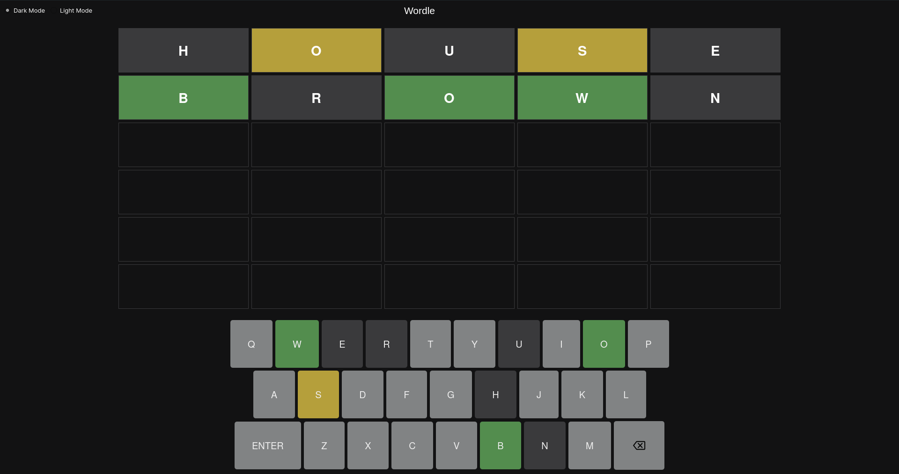
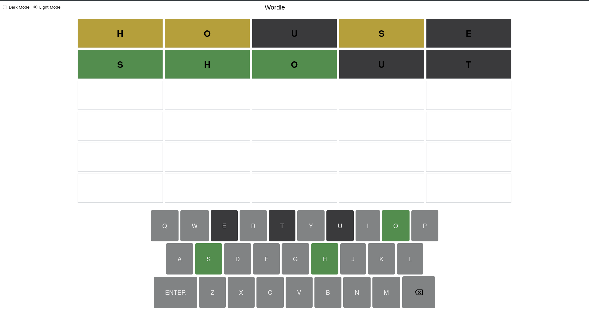

# Wordle
---
### Dark Mode



### Light Mode


## Description
---
Each time you play the game, a random word is gotten from the dictionary. The objective of the game is to guess the right word. The following are the guidelines of the game:
- If the letter entered is in the word but wasn't entered in the right position, the background turns yellow
- If the letter entered is in the word and in the right position, the backgroung turns green

## Getting started
---
### Dependencies
To use the app you first need to install the requirements. The only requirements is PyQt5, Io install PyQt5, open up your terminal and enter
```bash
pip install PyQt5
```

### Cloning Repository
To clone this repository, install git if you havent and then open the terminal and run
```bash
git clone https://github.com/joecode77/wordle.git
```

### Executing Program
To execute this program, open the terminal and change the working directory to the directory where main.py is and enter the following
```bash
python main.py
```
If you have more than one version of python installed it may be necessary to specify the version

**Note:** You can only execute the program if you have python installed

## Author
---
- Joseph Ogunfowokan
